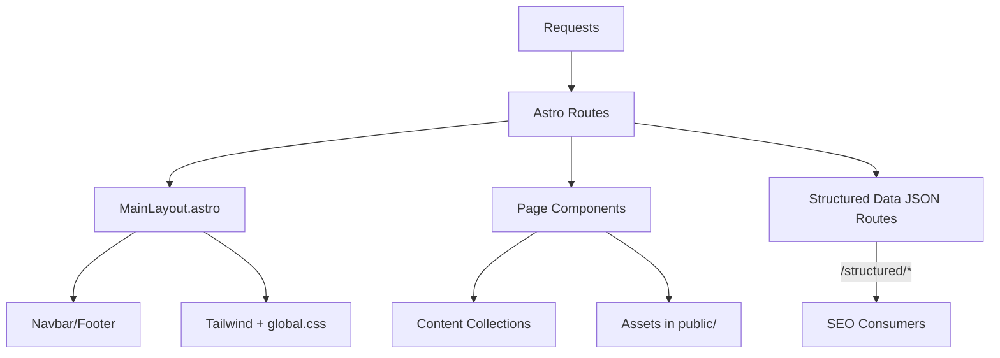
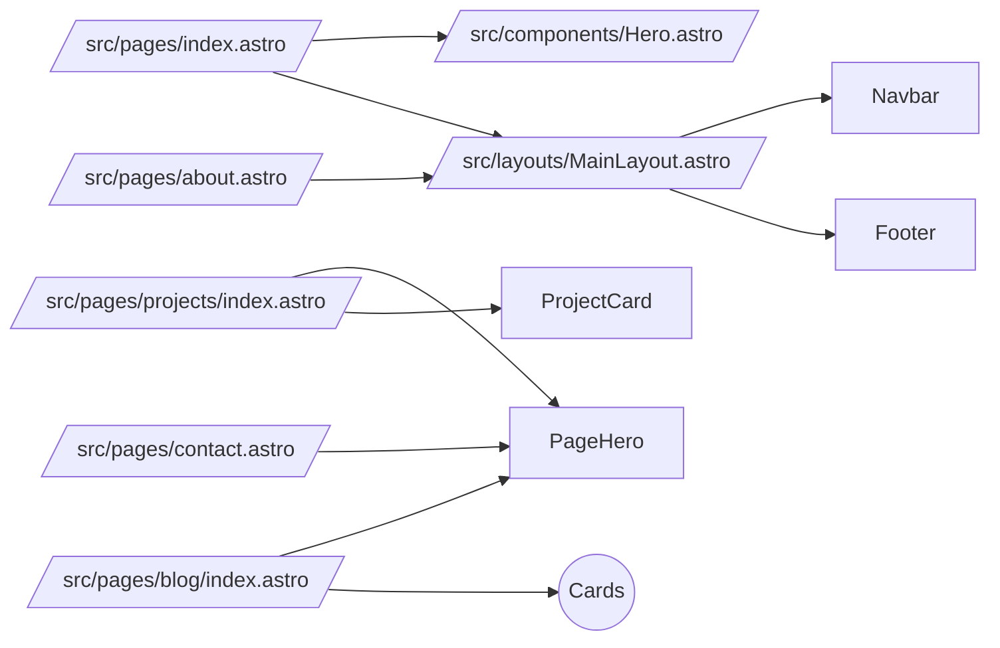

# Architecture

Who this is for: engineers and agents needing a high-level mental model.
What you’ll learn: system boundaries, rendering, routing, content, performance, and SEO/security hooks.

> TL;DR
> - Astro SSG with static export to `dist/`.
> - TailwindCSS for styling, tokens in `global.css` + `tailwind.config.js`.
> - Content via Astro Content Collections (`src/content/config.ts`).
> - Headers/CSP via `vercel.json` and `src/middleware.ts`.

## System overview

- Framework: Astro 5, output: `static` (see `astro.config.mjs`).
- Styling: Tailwind 3 + custom utilities in `src/styles/global.css`.
- Components: Astro components and a few React islands (`*.tsx`).
- Content: Collections for `blog`, `projects`, `creative` with Zod schemas.
- Images: responsive assets under `public/images`; optimizer `scripts/optimize-images.mjs` (Sharp).
- Deployment: static hosting (Vercel optimized via `vercel.json` headers/caching).

## Project layout

- `src/pages/**`: page routes (home, about, contact, blog, projects, creative, robots, ai, structured).
- `src/layouts/MainLayout.astro`: global shell, meta, fonts, background image orchestration.
- `src/components/**`: cards, heroes, navbar/footer, images.
- `src/content/config.ts`: Zod schemas + collection registration.
- `src/styles/global.css`: tokens, components/utilities, accessibility and motion prefs.
- `public/**`: static images, scripts (matrix rain, blog filters, navbar toggle, theme init).
- `scripts/optimize-images.mjs`: build-time responsive assets.
- `vercel.json`: cache and security headers, CSP.
- `src/middleware.ts`: CSP/headers fallback for non‑Vercel.

## Rendering model

- Astro Islands: React only where needed (`FeaturedProjectCard.tsx`, `OptimizedImage.tsx`).
- Client directives: primarily static; hydration is minimal.
- Structured data served via first‑party JSON endpoints (`src/pages/structured/**`).

## Routing model

- File-system routing. Dynamic collections for `blog/[slug].astro` and `projects/[slug].astro`.
- Utility text endpoints: `/robots.txt`, `/ai.txt`.
- JSON-LD endpoints: `/structured/person.json`, `/structured/website.json`, `/structured/blog/[slug].json`, `/structured/project/[slug].json`.

## Data/content flow

- Content authored in `src/content/{blog,projects,creative}` with schemas in `src/content/config.ts`.
- Pages query with `getCollection('...')` and render cards/details.
- Images referenced by path under `public/images/**`.

## Performance

- Static export + long‑term caching for assets (`/_astro`, `/images`, `/videos`).
- Image pipeline: Sharp to generate responsive WEBP/AVIF variants; components use `<picture>` sources.
- CSS inlining: `inlineStylesheets: 'always'` in `astro.config.mjs`.
- Tailwind safelist for dynamic classes; `content-visibility:auto` where helpful.

## SEO & structured data

- `robots.txt.ts` allows crawling, including AI bots; links to `/sitemap*.xml` and `/ai.txt`.
- `ai.txt.ts` declares community AI crawling policy.
- Per‑type JSON‑LD via `/structured/*` endpoints.
- Canonicals and OG/Twitter meta in `MainLayout.astro`.

## Security & headers

- `vercel.json` sets CSP, HSTS, XFO, XCTO, permissions policy.
- `src/middleware.ts` mirrors CSP for non‑Vercel.
- CSP allows Google Fonts CSS, Spotify frame, and self assets/scripts.

## Component dependency graph (key pages)

