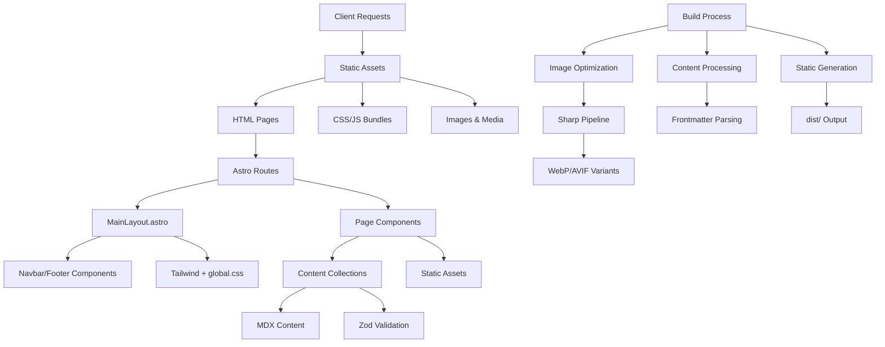
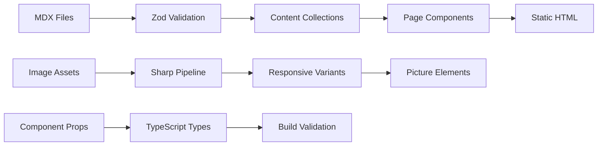
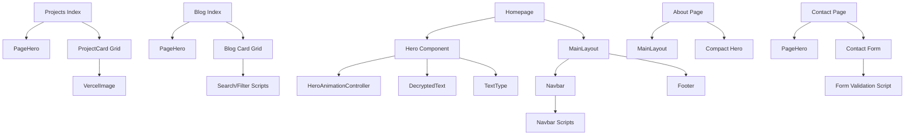
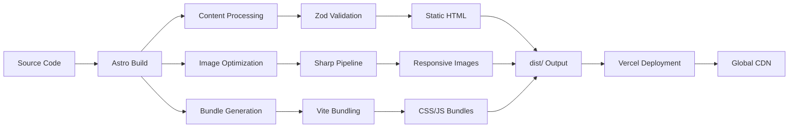

# 🏗️ Architecture

**Who this is for:** Engineers and agents needing a high-level mental model of the system architecture.  
**What you'll learn:** System boundaries, rendering model, routing, content management, performance optimizations, and SEO/security implementation.

> **TL;DR** - Astro 5 static site generator with content collections, React islands for interactive components, TailwindCSS for styling, and Vercel-optimized deployment. Features image optimization pipeline, structured data endpoints, and comprehensive security headers.

## 🎯 System Overview

- **Framework:** Astro 5.12.8 with `output: 'static'` (see `astro.config.mjs`)
- **Styling:** TailwindCSS 3.4.1 + custom utilities in `src/styles/global.css`
- **Package Manager:** pnpm 9.12.0 with Node.js 20.10.0
- **Components:** Astro components with React islands (`*.tsx`) for interactive elements
- **Content:** Collections for `blog`, `projects`, `creative` with Zod schemas
- **Images:** Responsive assets under `public/images` with Sharp optimization pipeline
- **Deployment:** Static hosting optimized for Vercel with CSP headers and caching



## 🏗️ Project Layout

### Core Directories
- **`src/pages/**`**: File-based routing (home, about, contact, blog, projects, creative)
- **`src/layouts/MainLayout.astro`**: Global shell, meta tags, fonts, background orchestration
- **`src/components/**`**: Reusable UI components (cards, heroes, navbar/footer, images)
- **`src/content/config.ts`**: Zod schemas + collection registration for type safety
- **`src/styles/global.css`**: Design tokens, component utilities, accessibility, motion preferences
- **`src/lib/**`**: Utility functions (analytics, social config, Spotify integration)

### Static Assets
- **`public/**`**: Static images, client-side scripts (matrix rain, blog filters, navbar toggle, theme init)
- **`scripts/optimize-images.mjs`**: Build-time responsive image generation with Sharp
- **`vercel.json`**: Cache policies, security headers, CSP configuration
- **`src/middleware.ts`**: CSP/headers fallback for non-Vercel deployments

### Configuration Files
- **`astro.config.mjs`**: Astro configuration with MDX, sitemap, React integration, and security plugins
- **`tailwind.config.js`**: Custom theme with Matrix-inspired color palette and utilities
- **`tsconfig.json`**: TypeScript strict mode configuration
- **`postcss.config.js`**: PostCSS with TailwindCSS and autoprefixer
- **`package.json`**: pnpm workspace with Node.js 20.10.0 and pnpm 9.12.0

## 🔄 Rendering Model

### Astro Islands Architecture
- **Static by Default**: All components render to HTML at build time
- **React Islands**: Interactive components (`FeaturedProjectCard.tsx`, `OptimizedImage.tsx`) hydrate on demand
- **Client Directives**: Minimal hydration; primarily static content with progressive enhancement
- **Performance**: Zero JavaScript by default, React only where needed

### Component Rendering Strategy
```typescript
// Static Astro components (default)
<Hero />
<ProjectCard project={project} />
<Footer />

// React islands for interactivity
<FeaturedProjectCard client:load />
<OptimizedImage client:visible />
<LightboxGallery client:load />
```

### Build Process
1. **Content Processing**: MDX files parsed and validated against Zod schemas
2. **Static Generation**: All pages pre-rendered to HTML
3. **Asset Optimization**: Images processed through Sharp pipeline with responsive variants
4. **Bundle Generation**: CSS/JS optimized and split by Astro
5. **Security**: Content sanitization and external link handling via rehype plugins
6. **Output**: Static files in `dist/` directory

## 🛣️ Routing Model

### File-Based Routing
- **Static Routes**: `/`, `/about`, `/contact`, `/projects`, `/blog`, `/creative`
- **Dynamic Routes**: `[slug].astro` for blog posts and project case studies
- **Utility Endpoints**: `/robots.txt`, `/ai.txt` for crawler configuration
- **Structured Data**: `/structured/*.json` for SEO consumers

### Route Structure
```
src/pages/
├── index.astro              # Homepage with hero animation
├── about.astro              # About page with compact hero
├── contact.astro            # Contact form with validation
├── projects/
│   ├── index.astro          # Projects grid with filtering
│   └── [slug].astro         # Dynamic project case study
├── blog/
│   ├── index.astro          # Blog grid with search/filter
│   └── [slug].astro         # Dynamic blog post
├── creative/
│   ├── index.astro          # Creative portfolio grid
│   └── [slug].astro         # Creative piece detail
├── robots.txt.ts            # Dynamic robots.txt
├── ai.txt.ts                # AI crawling policy
└── structured/               # JSON-LD endpoints
    ├── website.json.ts
    ├── person.json.ts
    ├── blog/[slug].json.ts
    └── project/[slug].json.ts
```

### Dynamic Route Generation
```typescript
// Example: projects/[slug].astro
export async function getStaticPaths() {
  const projects = await getCollection('projects');
  return projects.map((project) => ({
    params: { slug: project.slug },
    props: { project },
  }));
}
```

## 📊 Data & Content Flow

### Content Collections
- **Source**: Markdown/MDX files in `src/content/{blog,projects,creative}/`
- **Validation**: Zod schemas ensure type safety and data integrity
- **Querying**: `getCollection()` function with filtering and sorting
- **Rendering**: Content processed and rendered to HTML at build time

### Content Schema Example
```typescript
// src/content/config.ts
const projectSchema = z.object({
  title: z.string(),
  description: z.string(),
  techStack: z.array(z.string()),
  publishedAt: z.string(),
  status: z.enum(['completed', 'in-progress', 'archived']),
  // ... other fields
});

export const collections = {
  projects: defineCollection({
    type: 'content',
    schema: projectSchema,
  }),
};
```

### Data Flow Architecture


### Image Pipeline
1. **Source Images**: High-resolution images in `public/images/`
2. **Build Processing**: Sharp generates WebP/AVIF variants
3. **Responsive Output**: Multiple sizes for different viewports
4. **Component Usage**: `<picture>` elements with source sets
5. **Lazy Loading**: Images load as they enter viewport

## ⚡ Performance Optimizations

### Static Generation Benefits
- **Zero JavaScript**: Pages load without client-side processing
- **Fast TTFB**: Pre-rendered HTML served immediately
- **CDN Friendly**: Static assets easily cached and distributed
- **SEO Optimized**: Content immediately available to crawlers

### Asset Optimization
- **CSS Inlining**: `inlineStylesheets: 'always'` in Astro config
- **Code Splitting**: Automatic by Astro for optimal bundle sizes
- **Image Optimization**: WebP/AVIF with fallbacks for older browsers
- **Font Loading**: `font-display: swap` for optimal typography performance

### Caching Strategy
```json
// vercel.json
{
  "headers": [
    {
      "source": "/_astro/(.*)",
      "headers": [
        {
          "key": "Cache-Control",
          "value": "public, max-age=31536000, immutable"
        }
      ]
    },
    {
      "source": "/images/(.*)",
      "headers": [
        {
          "key": "Cache-Control",
          "value": "public, max-age=31536000, immutable"
        }
      ]
    }
  ]
}
```

### Core Web Vitals Optimization
- **LCP**: Optimized images and critical CSS inlining
- **FID**: Minimal JavaScript and efficient event handling
- **CLS**: Stable layouts with proper image dimensions
- **FCP**: Fast first contentful paint with optimized fonts

## 🔍 SEO & Structured Data

### Meta Tags & Open Graph
- **Dynamic Titles**: Page-specific titles with brand suffix
- **Meta Descriptions**: Unique descriptions for each page
- **Open Graph**: Social media sharing optimization
- **Twitter Cards**: Enhanced Twitter sharing experience

### Structured Data Implementation
- **JSON-LD**: Served via dedicated endpoints for better caching
- **Schema Types**: WebSite, Person, BlogPosting, CreativeWork
- **Dynamic Content**: Structured data generated from content collections
- **SEO Consumers**: Search engines and AI crawlers

### Crawler Configuration
```typescript
// robots.txt.ts
export async function GET() {
  return new Response(
    `# robots.txt generated by Astro
User-agent: *
Allow: /
Crawl-delay: 1

# Explicit AI/LLM crawlers
User-agent: GPTBot
Allow: /

User-agent: OAI-SearchBot
Allow: /

User-agent: Google-Extended
Allow: /

User-agent: Applebot-Extended
Allow: /

User-agent: CCBot
Allow: /

User-agent: PerplexityBot
Allow: /

User-agent: ClaudeBot
Allow: /

User-agent: Claude-Web
Allow: /

User-agent: Bytespider
Allow: /

User-agent: Amazonbot
Allow: /

# Sitemaps
Sitemap: https://vpoliteiadis.com/sitemap-index.xml
Sitemap: https://vpoliteiadis.com/sitemap.xml

# AI policy
AI policy: https://vpoliteiadis.com/ai.txt`,
    { headers: { 'Content-Type': 'text/plain' } }
  );
}
```

### AI Crawling Policy
```typescript
// ai.txt.ts
export async function GET() {
  return new Response(
    `# ai.txt — AI crawling and usage policy
# Site: https://vpoliteiadis.com

# Indexing
Allow: *

# Attribution
Require-Attribution: true

# Rate limits
Crawl-Delay: 1

# Contact
Contact: mailto:b.politiadis@gmail.com

# Notes
Purpose: Permit AI crawlers to index public pages and snippets with attribution. No PII is published.`,
    { headers: { 'Content-Type': 'text/plain' } }
  );
}
```

## 🔒 Security & Headers

### Content Security Policy & Security Headers
```json
// vercel.json
{
  "headers": [
    {
      "source": "/(.*)",
      "headers": [
        {
          "key": "Content-Security-Policy",
          "value": "default-src 'self'; script-src 'self' 'unsafe-inline'; script-src-elem 'self' 'unsafe-inline'; style-src 'self' 'unsafe-inline' https://fonts.googleapis.com; img-src 'self' data: https:; font-src 'self' https://fonts.gstatic.com; connect-src 'self'; frame-ancestors 'none'; base-uri 'self'; form-action 'self'; object-src 'none'; frame-src https://open.spotify.com; upgrade-insecure-requests"
        },
        {
          "key": "X-Frame-Options",
          "value": "DENY"
        },
        {
          "key": "X-Content-Type-Options",
          "value": "nosniff"
        },
        {
          "key": "Referrer-Policy",
          "value": "strict-origin-when-cross-origin"
        },
        {
          "key": "Permissions-Policy",
          "value": "geolocation=(), microphone=(), camera=(), interest-cohort=()"
        },
        {
          "key": "Cross-Origin-Opener-Policy",
          "value": "same-origin-allow-popups"
        },
        {
          "key": "Cross-Origin-Embedder-Policy",
          "value": "unsafe-none"
        },
        {
          "key": "Cross-Origin-Resource-Policy",
          "value": "cross-origin"
        },
        {
          "key": "Strict-Transport-Security",
          "value": "max-age=63072000; includeSubDomains; preload"
        }
      ]
    }
  ]
}
```

### Security Headers
- **HSTS**: Strict transport security for HTTPS enforcement
- **X-Frame-Options**: Prevent clickjacking attacks
- **X-Content-Type-Options**: Prevent MIME type sniffing
- **Referrer Policy**: Control referrer information
- **Permissions Policy**: Feature policy for modern browsers

### Middleware Fallback
```typescript
// src/middleware.ts
export function onRequest({ request, next }: APIContext) {
  const response = await next();
  
  // Add security headers for non-Vercel deployments
  response.headers.set('X-Content-Type-Options', 'nosniff');
  response.headers.set('X-Frame-Options', 'DENY');
  response.headers.set('Referrer-Policy', 'strict-origin-when-cross-origin');
  
  return response;
}
```

## 🧩 Component Dependency Graph

### Key Page Dependencies


### Component Hierarchy
- **Layout Level**: MainLayout.astro wraps all pages
- **Page Level**: Page-specific components and content
- **Component Level**: Reusable UI components
- **Utility Level**: Helper functions and configurations

## 🚀 Deployment Architecture

### Vercel Optimization
- **Edge Functions**: Global CDN distribution
- **Build Optimization**: Automatic build caching and optimization
- **Performance Monitoring**: Built-in analytics and Core Web Vitals tracking
- **Security**: Automatic HTTPS and DDoS protection

### Build Pipeline


### Environment Configuration
- **Development**: Hot module replacement and fast refresh
- **Production**: Optimized builds with minification
- **Staging**: Preview deployments for testing
- **Analytics**: Vercel Analytics and Google Analytics integration

---

**This architecture prioritizes performance, security, and developer experience while maintaining the Matrix-inspired aesthetic and ensuring optimal SEO and accessibility.**
