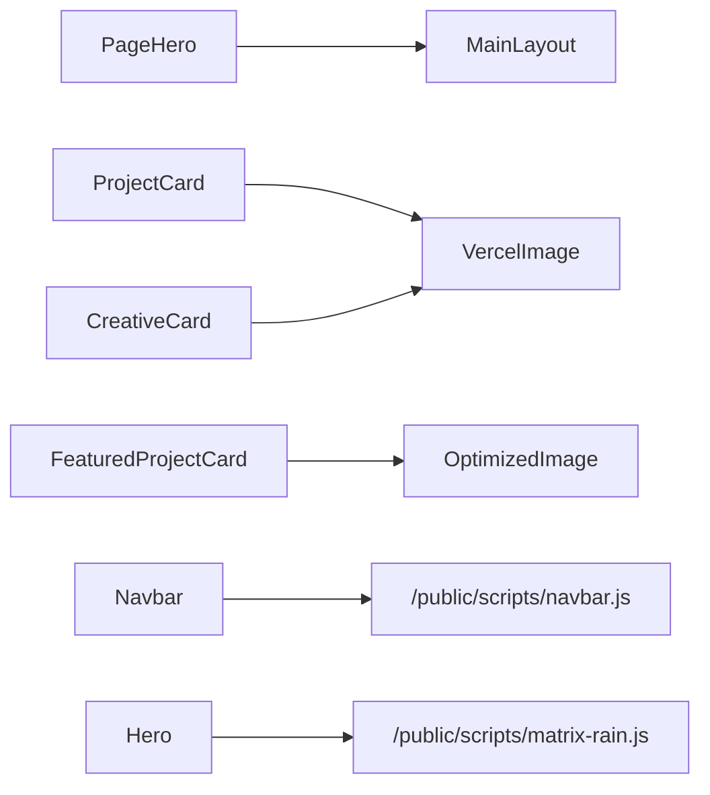

# Components Reference

Who this is for: developers reusing/extending UI blocks.
What you’ll learn: inventory, purpose, props, and dependencies.

> TL;DR
> - Astro components are static by default; React used where needed.
> - Prefer existing tokens/utilities for consistent UI.

## Inventory (by domain)

### Layout

| Path | Purpose | Key props |
|---|---|---|
| `src/layouts/MainLayout.astro` | Global shell, meta, backgrounds, navbar/footer | `title`, `description`, `currentPath`, `bgSlug`, `bgEager`, `bgOpacityClass`, `bgOverlayClass` |

### Navigation & chrome

| Path | Purpose | Key props |
|---|---|---|
| `src/components/Navbar.astro` | Top nav with mobile menu script | `currentPath?` |
| `src/components/Footer.astro` | Footer with social links | — |

### Sections/Blocks

| Path | Purpose | Key props |
|---|---|---|
| `src/components/Hero.astro` | Home hero with matrix rain | — |
| `src/components/PageHero.astro` | Page hero with optional background | `title` (req), `description?`, `bgSlug?`, `metaText?`, `eager?` |

### Cards

| Path | Purpose | Key props |
|---|---|---|
| `src/components/ProjectCard.astro` | Project card (from content collection) | `project` (object with `slug`, `data`) |
| `src/components/CreativeCard.astro` | Creative piece card | `creative` (object with `slug`, `data`) |
| `src/components/FeaturedProjectCard.tsx` | Featured, rich project card (React) | see props in file (`title`, `role`, `description`, `hero`, `detailUrl`, `cta`, etc.) |

### Media & embeds

| Path | Purpose | Key props |
|---|---|---|
| `src/components/SpotifyEmbed.astro` | Spotify iframe helper | `src` or (`type`, `id`); `height?`, `title?`, `theme?` |
| `src/components/VercelImage.astro` | Image helper using Vercel optimizer in prod | `src`, `alt?`, `width?`, `quality?`, `class?` |
| `src/components/OptimizedImage.tsx` | React image helper (Vercel optimizer aware) | `src`, `width?`, `quality?`, plus `` attrs |

### Modals

| Path | Purpose | Key props |
|---|---|---|
| `src/components/CreativeModal.astro` | Accessible modal/lightbox for creative items (inline script) | `id` |

## Dependencies between components



## Usage examples

Minimal `PageHero`:

```astro
---
import PageHero from '../components/PageHero.astro';
---
<PageHero title="Projects" description="Selected work" bgSlug="projects-bg" eager />
```

Rendering projects (from content collection):

```astro
---
import ProjectCard from '../components/ProjectCard.astro';
import { getCollection } from 'astro:content';
const projects = await getCollection('projects');
---
{projects.map((p) => (<ProjectCard project={p} />))}
```
