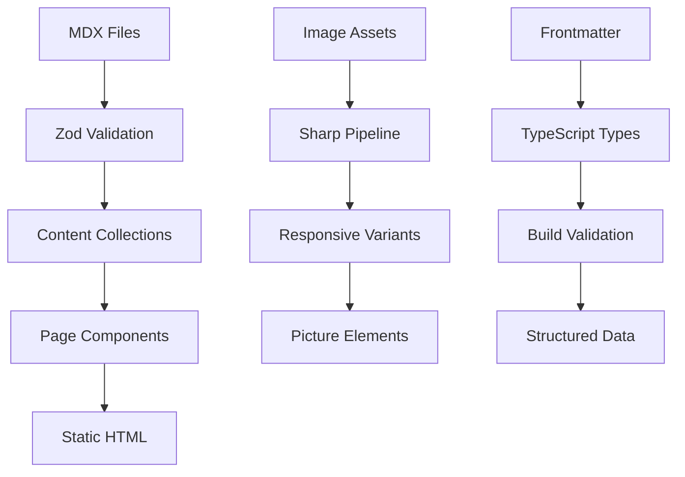

# 📚 Content Management

**Who this is for:** Content creators, editors, and developers managing blog posts, projects, and creative work.

**What you'll learn:** Content collections, schemas, creation workflows, and media management for the portfolio.

> **TL;DR** - Astro Content Collections with Zod validation for type-safe content. Three collections: projects, blog, creative. MDX support with structured data generation.

## 🏗️ Content Architecture

### Overview

The portfolio uses Astro's Content Collections system for type-safe, structured content management:

- **Collections**: `projects`, `blog`, `creative`
- **Format**: Markdown/MDX with frontmatter
- **Validation**: Zod schemas ensure data integrity
- **Processing**: Build-time content processing and optimization
- **Output**: Static HTML with structured data endpoints

### Content Flow



## 📁 Content Collections

### Projects Collection (`src/content/projects/`)

**Purpose:** Professional case studies and portfolio items showcasing technical work.

**Schema Fields:**
- `title`, `description`, `excerpt` - Basic content
- `coverImage`, `coverVideo`, `gallery` - Media assets
- `tags`, `techStack` - Categorization
- `featured` - Homepage placement
- `publishedAt`, `updatedAt` - Timestamps
- `client`, `duration`, `role` - Project details
- `problem`, `solution`, `impact` - Case study content
- `challenges`, `learnings` - Insights
- `liveUrl`, `githubUrl`, `caseStudyUrl` - Links

**Example Project:**
```yaml
---
title: "Casa Capoeira - Digital Transformation"
description: "Complete digital transformation of a traditional capoeira school"
excerpt: "Modernizing a 20-year-old capoeira school with digital tools"
coverImage: "/images/projects/casa-capoeira-hero.webp"
tags: ["digital-transformation", "automation", "education"]
techStack: ["React", "Node.js", "PostgreSQL", "Stripe"]
featured: true
publishedAt: "2024-12-01"
client: "Casa Capoeira"
duration: "6 months"
problem: "Manual processes causing inefficiencies"
solution: "Integrated digital platform"
impact: "40% reduction in administrative overhead"
---
```

### Blog Collection (`src/content/blog/`)

**Purpose:** Technical articles, tutorials, and insights about development and career growth.

**Schema Fields:**
- `title`, `description`, `excerpt` - Basic content
- `coverImage` - Hero image
- `author` - Author name (default: Vasileios Politeiadis)
- `tags`, `category` - Organization
- `featured` - Homepage placement
- `publishedAt`, `updatedAt` - Timestamps
- `readingTime` - Estimated read time
- `draft` - Publication status
- `seo` - Search optimization fields

**Categories:** `technology`, `ai`, `development`, `automation`, `creative`, `career`, `tutorial`, `finance`

**Example Blog Post:**
```yaml
---
title: "Mastering AI-Assisted Creativity"
description: "How to leverage AI tools for enhanced creative workflows"
excerpt: "Discover practical strategies for integrating AI into your creative process"
coverImage: "/images/blog/ai-creativity-cover.webp"
tags: ["ai", "creativity", "development", "workflow"]
category: "ai"
featured: true
publishedAt: "2024-12-15"
readingTime: "8 min read"
draft: false
---
```

### Creative Collection (`src/content/creative/`)

**Purpose:** AI-generated art, digital creations, and experimental pieces.

**Note:** Currently no creative pieces are published, but infrastructure is ready.

**Schema Fields:**
- `title`, `description`, `excerpt` - Basic content
- `mediaType` - `image`, `video`, `gallery`
- `coverImage`, `coverVideo`, `gallery` - Media assets
- `tools` - Creation tools/software
- `tags`, `category` - Organization
- `featured` - Homepage placement
- `publishedAt`, `updatedAt` - Timestamps
- `client` - Commission client
- `prompt`, `process` - AI generation details

**Categories:** `ai-art`, `digital-art`, `experiment`, `commission`

## 🖼️ Media Management

### Image Organization

**Directory Structure:**
```
public/images/
├── projects/     # Project screenshots and mockups
├── blog/         # Blog post covers and illustrations
├── creative/     # AI art and creative pieces
├── about/        # About page images
└── shared/       # Common UI elements
```

### Image Optimization

- **Source Images**: High-resolution images stored in `public/images/`
- **Build Processing**: Sharp generates responsive variants during build
- **Format Optimization**: WebP/AVIF with fallbacks for older browsers
- **Responsive Output**: Multiple sizes for different viewports
- **Component Usage**: Optimized delivery via Astro Image component

### Image Usage in Content

**In Frontmatter:**
```yaml
coverImage: "/images/projects/project-hero.webp"
gallery:
  - "/images/projects/screenshot-1.webp"
  - "/images/projects/screenshot-2.webp"
```

**In MDX Content:**
```astro
<Image
  src="/images/blog/diagram.webp"
  alt="Architecture diagram"
  width={800}
  height={600}
/>
```

## 🔄 Content Processing

### Build-Time Pipeline

1. **Content Processing**: MDX files parsed and validated against Zod schemas
2. **Type Generation**: TypeScript types generated from schemas
3. **Static Generation**: Content rendered to HTML at build time
4. **SEO Processing**: Structured data and meta tags generated
5. **Image Optimization**: Media assets processed for optimal delivery

### Schema Validation

```typescript
// src/content/config.ts
const projectSchema = z.object({
  title: z.string(),
  description: z.string(),
  coverImage: z.string(),
  tags: z.array(z.string()),
  publishedAt: z.string(),
  // ... additional fields
});

export const collections = {
  projects: defineCollection({
    type: 'content',
    schema: projectSchema,
  }),
};
```

### Type Safety

```typescript
// Generated types from schemas
import type { CollectionEntry } from 'astro:content';

type Project = CollectionEntry<'projects'>;
type Blog = CollectionEntry<'blog'>;
type Creative = CollectionEntry<'creative'>;
```

## 📊 Content Querying

### Basic Queries

```typescript
import { getCollection } from 'astro:content';

// Get all projects
const projects = await getCollection('projects');

// Get featured projects only
const featuredProjects = await getCollection('projects', ({ data }) => {
  return data.featured === true;
});

// Get projects by tag
const aiProjects = await getCollection('projects', ({ data }) => {
  return data.tags.includes('ai');
});
```

### Advanced Filtering

```typescript
// Filter by multiple criteria
const filteredProjects = await getCollection('projects', ({ data }) => {
  return (
    data.status === 'completed' &&
    data.techStack.includes('React') &&
    data.publishedAt >= '2024-01-01'
  );
});

// Sort by publication date
const sortedProjects = projects.sort((a, b) =>
  new Date(b.data.publishedAt).getTime() - new Date(a.data.publishedAt).getTime()
);
```

## 📝 Content Creation Workflow

### Adding New Content

1. **Create File**: Add `.md` or `.mdx` file to appropriate collection directory
2. **Frontmatter**: Fill required fields according to schema
3. **Content**: Write using Markdown/MDX syntax
4. **Images**: Add images to `public/images/` and reference in frontmatter
5. **Validation**: Run `pnpm build` to validate against schemas
6. **Preview**: Use `pnpm dev` to preview changes

### Content Guidelines

- **Titles**: Clear, descriptive, SEO-friendly (50-60 characters)
- **Descriptions**: Compelling summaries under 160 characters
- **Tags**: Use existing tags when possible, add new ones sparingly
- **Images**: High-quality, relevant, properly optimized
- **Content**: Engaging, informative, well-structured with headings

### MDX Features

```mdx
---
title: "Using MDX in Content"
---

# MDX Support

You can use React components in your content!

<GlassCard>
  This content is rendered with full React component support.
</GlassCard>

```typescript
const code = "Highlighted with syntax highlighting";
```

<SpotifyEmbed type="track" id="4iV5W9uYEdYUVa79Axb7Rh" />
```

## 🏷️ Tagging & Organization

### Tag System

**Technology Tags:**
- `react`, `nodejs`, `typescript`, `ai`, `automation`
- `astro`, `tailwindcss`, `vercel`, `postgresql`

**Domain Tags:**
- `education`, `finance`, `healthcare`, `e-commerce`
- `digital-transformation`, `consulting`, `freelance`

**Process Tags:**
- `automation`, `optimization`, `migration`, `api-design`
- `ui-ux`, `performance`, `accessibility`

### Category Organization

**Projects:** `web-app`, `mobile-app`, `api`, `automation`, `consulting`
**Blog:** `technology`, `ai`, `development`, `automation`, `creative`, `career`, `tutorial`, `finance`
**Creative:** `ai-art`, `digital-art`, `experiment`, `commission`

## 🔍 SEO & Structured Data

### Meta Tags Generation

- **Dynamic Titles**: Page-specific titles with brand suffix
- **Meta Descriptions**: Unique descriptions for each content piece
- **Open Graph**: Social media sharing optimization
- **Twitter Cards**: Enhanced social sharing experience

### Structured Data

- **JSON-LD**: Generated from content collections
- **Schema Types**: BlogPosting, CreativeWork, Person, WebSite
- **Dynamic Content**: Structured data reflects actual content
- **SEO Consumers**: Search engines and AI crawlers

### Content Optimization

```typescript
// Generate meta tags from content
export const generateMeta = (content: Project | Blog | Creative) => {
  return {
    title: `${content.data.title} | Vasileios Politeiadis`,
    description: content.data.description,
    openGraph: {
      title: content.data.title,
      description: content.data.description,
      image: content.data.coverImage,
    },
  };
};
```

## 🚀 Publishing Workflow

### Draft to Published

1. **Create Content**: Add file with `draft: true` (for blog posts)
2. **Review**: Preview locally with `pnpm dev`
3. **Validate**: Run `pnpm build` to ensure no errors
4. **Publish**: Set `draft: false` or remove draft field
5. **Deploy**: Push changes to trigger deployment

### Content Updates

- **Frontmatter Changes**: Update metadata fields as needed
- **Content Edits**: Modify MDX content directly
- **Image Updates**: Replace images in `public/images/`
- **Version Control**: All changes tracked in Git history

### Featured Content

- **Homepage Placement**: Set `featured: true` for homepage display
- **Priority Ordering**: Featured content appears first in listings
- **Limited Slots**: Typically 3-6 featured items per collection

## 📊 Content Analytics

### Performance Metrics

- **Page Views**: Track via Vercel Analytics
- **Read Time**: Estimated from content length
- **Engagement**: Social shares and backlinks
- **SEO Performance**: Search rankings and traffic

### Content Strategy

- **Regular Publishing**: Consistent content schedule
- **Audience Focus**: Technical depth with practical insights
- **Cross-linking**: Internal links between related content
- **Image Quality**: High-resolution, optimized media assets

---

**Need help with content?** Check the [DEVELOPMENT.md](./DEVELOPMENT.md) for technical setup, or [TROUBLESHOOTING.md](./TROUBLESHOOTING.md) for common content issues.