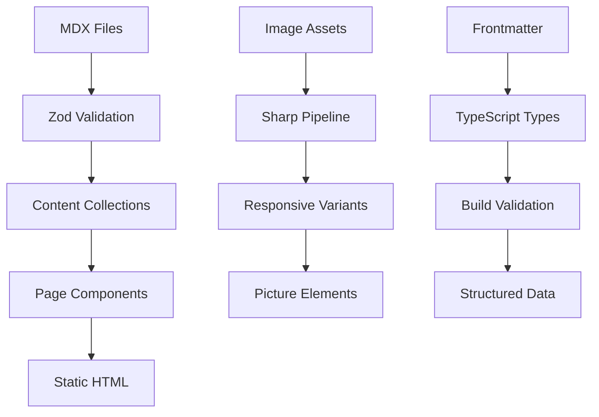
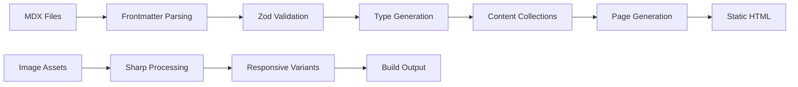

# 📚 Content Model

**Who this is for:** Content creators, developers, and AI agents working with the portfolio's content system.  
**What you'll learn:** Content collections, Zod schemas, data flow, image management, and content creation workflows.

> **TL;DR** - Astro Content Collections with Zod validation for type-safe content management. Three main collections: projects, blog, and creative. MDX support for rich content, image optimization pipeline, and structured data generation.

## 🏗️ Content Architecture

### Overview
The portfolio uses Astro's Content Collections system for type-safe, structured content management:

- **Collections**: `projects`, `blog`, `creative`
- **Format**: Markdown/MDX with frontmatter
- **Validation**: Zod schemas ensure data integrity
- **Processing**: Build-time content processing and optimization
- **Output**: Static HTML with structured data endpoints

### Content Flow


## 📁 Content Collections

### Projects Collection
**Path:** `src/content/projects/`

**Purpose:** Professional case studies and portfolio items showcasing technical work.

**Schema:** Defined in `src/content/config.ts`
```typescript
const projectSchema = z.object({
  title: z.string(),
  description: z.string(),
  excerpt: z.string().optional(),
  coverImage: z.string(),
  coverVideo: z.string().optional(),
  tags: z.array(z.string()),
  techStack: z.array(z.string()),
  featured: z.boolean().default(false),
  publishedAt: z.string(),
  updatedAt: z.string().optional(),
  client: z.string().optional(),
  duration: z.string().optional(),
  role: z.string().optional(),
  team: z.array(z.string()).optional(),
  problem: z.string(),
  solution: z.string(),
  impact: z.string(),
  challenges: z.array(z.string()).optional(),
  learnings: z.array(z.string()).optional(),
  liveUrl: z.string().optional(),
  githubUrl: z.string().optional(),
  caseStudyUrl: z.string().optional(),
  status: z.enum(['completed', 'in-progress', 'archived']).default('completed'),
  featuredImage: z.string().optional(),
  gallery: z.array(z.string()).optional(),
  // Compact page fields
  roleSummary: z.string().optional(),
  highlights: z.array(z.string()).optional(),
  // UI/UX split sections
  about: z.string().optional(),
  roleDetails: z.string().optional(),
  roleHighlights: z.array(z.string()).optional(),
});
```

**Example Project:**
```yaml
---
title: "Casa Capoeira - Digital Transformation"
description: "Complete digital transformation of a traditional capoeira school"
excerpt: "Modernizing a 20-year-old capoeira school with digital tools and automation"
coverImage: "/images/projects/casa-capoeira-hero.webp"
tags: ["digital-transformation", "automation", "education", "capoeira"]
techStack: ["React", "Node.js", "PostgreSQL", "Stripe", "SendGrid"]
featured: true
publishedAt: "2024-12-01"
client: "Casa Capoeira"
duration: "6 months"
role: "Full-Stack Developer & Project Lead"
problem: "Manual processes causing inefficiencies and poor student experience"
solution: "Integrated digital platform with automated workflows"
impact: "40% reduction in administrative overhead, improved student retention"
challenges: ["Legacy system integration", "User adoption", "Data migration"]
learnings: ["Change management in traditional organizations", "Automation ROI measurement"]
liveUrl: "https://casacapoeira.com"
githubUrl: "https://github.com/username/casa-capoeira"
status: "completed"
gallery: [
  "/images/projects/casa-capoeira-1.webp",
  "/images/projects/casa-capoeira-2.webp"
]
---

# Casa Capoeira Digital Transformation

## Project Overview

This project modernized a traditional capoeira school...
```

### Blog Collection
**Path:** `src/content/blog/`

**Purpose:** Technical articles, tutorials, and insights about development, AI, and career growth.

**Schema:**
```typescript
const blogSchema = z.object({
  title: z.string(),
  description: z.string(),
  excerpt: z.string().optional(),
  coverImage: z.string().optional(),
  author: z.string().default('Vasileios Politeiadis'),
  tags: z.array(z.string()),
  category: z.enum([
    'technology',
    'ai',
    'development',
    'automation',
    'creative',
    'career',
    'tutorial',
    'finance',
  ]),
  featured: z.boolean().default(false),
  publishedAt: z.string(),
  updatedAt: z.string().optional(),
  readingTime: z.string().optional(),
  draft: z.boolean().default(false),
  seo: z.object({
    title: z.string().optional(),
    description: z.string().optional(),
    keywords: z.array(z.string()).optional(),
  }).optional(),
});
```

**Example Blog Post:**
```yaml
---
title: "Mastering AI-Assisted Creativity: A Developer's Guide"
description: "How to leverage AI tools for enhanced creative workflows in development"
excerpt: "Discover practical strategies for integrating AI into your creative process"
coverImage: "/images/blog/ai-creativity-cover.webp"
author: "Vasileios Politeiadis"
tags: ["ai", "creativity", "development", "workflow", "productivity"]
category: "ai"
featured: true
publishedAt: "2024-12-15"
readingTime: "8 min read"
draft: false
seo:
  title: "AI-Assisted Creativity Guide for Developers"
  description: "Learn how to enhance your creative workflow with AI tools"
  keywords: ["AI creativity", "developer productivity", "AI tools", "workflow optimization"]
---

# Mastering AI-Assisted Creativity

## Introduction

As developers, we're constantly seeking ways to enhance our creative process...
```

### Creative Collection
**Path:** `src/content/creative/`

**Purpose:** AI-generated art, digital creations, and experimental pieces showcasing artistic vision.

**Schema:**
```typescript
const creativeSchema = z.object({
  title: z.string(),
  description: z.string(),
  excerpt: z.string().optional(),
  mediaType: z.enum(['image', 'video', 'gallery']),
  coverImage: z.string(),
  coverVideo: z.string().optional(),
  gallery: z.array(z.string()).optional(),
  tools: z.array(z.string()),
  tags: z.array(z.string()),
  category: z.enum(['ai-art', 'digital-art', 'experiment', 'commission']),
  featured: z.boolean().default(false),
  publishedAt: z.string(),
  updatedAt: z.string().optional(),
  client: z.string().optional(),
  instagramUrl: z.string().optional(),
  aspectRatio: z.string().optional(),
  dimensions: z.string().optional(),
  prompt: z.string().optional(),
  process: z.string().optional(),
});
```

**Example Creative Piece:**
```yaml
---
title: "Arte Imaginari - AI-Generated Portrait Series"
description: "A collection of AI-generated portraits exploring identity and digital aesthetics"
excerpt: "Exploring the intersection of AI creativity and human expression"
mediaType: "gallery"
coverImage: "/images/creative/arte-imaginari-cover.webp"
gallery: [
  "/images/creative/arte-imaginari-1.webp",
  "/images/creative/arte-imaginari-2.webp",
  "/images/creative/arte-imaginari-3.webp"
]
tools: ["Midjourney", "Kling AI", "Photoshop"]
tags: ["ai-art", "portraits", "digital-art", "identity", "aesthetics"]
category: "ai-art"
featured: true
publishedAt: "2024-12-10"
aspectRatio: "1/1"
dimensions: "2048x2048"
prompt: "Portrait of a cyberpunk character with neon lighting, digital art style"
process: "Started with Midjourney generation, refined with Kling AI, final touches in Photoshop"
---

# Arte Imaginari

## Concept

This series explores the concept of digital identity through AI-generated portraits...
```

## 🖼️ Image Management

### Image Pipeline
1. **Source Images**: High-resolution images stored in `public/images/`
2. **Build Processing**: Sharp generates responsive variants during build
3. **Format Optimization**: WebP/AVIF with fallbacks for older browsers
4. **Responsive Output**: Multiple sizes for different viewports
5. **Component Usage**: `<picture>` elements with source sets

### Image Organization
```
public/images/
├── projects/           # Project screenshots and mockups
│   ├── casa-capoeira/
│   └── upiria/
├── blog/              # Blog post covers and illustrations
├── creative/          # AI art and creative pieces
├── about/             # About page images
├── contact/           # Contact page assets
└── shared/            # Common UI elements
```

### Image Optimization
```typescript
// scripts/optimize-images.mjs
import sharp from 'sharp';

const optimizeImage = async (inputPath, outputPath, options) => {
  await sharp(inputPath)
    .resize(options.width, options.height, { fit: 'cover' })
    .webp({ quality: 80 })
    .toFile(outputPath);
};
```

### Responsive Images
```astro
<!-- Example: VercelImage component -->
<VercelImage
  src="/images/projects/project-hero.webp"
  alt="Project hero image"
  width={800}
  height={600}
  quality={80}
  class="rounded-lg shadow-lg"
/>
```

## 🔄 Data Flow & Processing

### Content Processing Pipeline


### Build-Time Validation
```typescript
// src/content/config.ts
export const collections = {
  projects: defineCollection({
    type: 'content',
    schema: projectSchema,
  }),
  blog: defineCollection({
    type: 'content',
    schema: blogSchema,
  }),
  creative: defineCollection({
    type: 'content',
    schema: creativeSchema,
  }),
};
```

### Type Safety
```typescript
// Generated types from schemas
import type { CollectionEntry } from 'astro:content';

type Project = CollectionEntry<'projects'>;
type Blog = CollectionEntry<'blog'>;
type Creative = CollectionEntry<'creative'>;

// Usage in components
const project: Project = await getEntry('projects', 'casa-capoeira');
```

## 📊 Content Querying

### Basic Queries
```typescript
import { getCollection } from 'astro:content';

// Get all projects
const projects = await getCollection('projects');

// Get featured projects only
const featuredProjects = await getCollection('projects', ({ data }) => {
  return data.featured === true;
});

// Get projects by tag
const aiProjects = await getCollection('projects', ({ data }) => {
  return data.tags.includes('ai');
});
```

### Advanced Filtering
```typescript
// Get projects with multiple criteria
const filteredProjects = await getCollection('projects', ({ data }) => {
  return (
    data.status === 'completed' &&
    data.techStack.includes('React') &&
    data.publishedAt >= '2024-01-01'
  );
});

// Sort by publication date
const sortedProjects = projects.sort((a, b) => 
  new Date(b.data.publishedAt).getTime() - new Date(a.data.publishedAt).getTime()
);
```

### Content Relationships
```typescript
// Get related content based on tags
const getRelatedContent = async (currentSlug: string, tags: string[]) => {
  const allProjects = await getCollection('projects');
  
  return allProjects
    .filter(project => project.slug !== currentSlug)
    .filter(project => 
      project.data.tags.some(tag => tags.includes(tag))
    )
    .slice(0, 3);
};
```

## 🏷️ Tagging & Categorization

### Tag System
- **Technology Tags**: `react`, `nodejs`, `typescript`, `ai`, `automation`
- **Domain Tags**: `education`, `finance`, `healthcare`, `e-commerce`
- **Process Tags**: `digital-transformation`, `automation`, `migration`, `optimization`
- **Creative Tags**: `ai-art`, `digital-art`, `portraits`, `landscapes`

### Category Organization
- **Projects**: `web-app`, `mobile-app`, `api`, `automation`, `consulting`
- **Blog**: `technology`, `ai`, `development`, `automation`, `creative`, `career`, `tutorial`, `finance`
- **Creative**: `ai-art`, `digital-art`, `experiment`, `commission`

### Tag Management
```typescript
// Get all unique tags across collections
const getAllTags = async () => {
  const projects = await getCollection('projects');
  const blog = await getCollection('blog');
  const creative = await getCollection('creative');
  
  const allTags = [
    ...projects.flatMap(p => p.data.tags),
    ...blog.flatMap(b => b.data.tags),
    ...creative.flatMap(c => c.data.tags)
  ];
  
  return [...new Set(allTags)].sort();
};
```

## 📝 Content Creation Workflow

### Adding New Content
1. **Create File**: Add new `.md` or `.mdx` file to appropriate collection directory
2. **Frontmatter**: Fill in required fields according to schema
3. **Content**: Write content using Markdown/MDX syntax
4. **Images**: Add images to `public/images/` and reference in frontmatter
5. **Validation**: Run `pnpm build` to validate against schemas
6. **Preview**: Use `pnpm dev` to preview changes

### Content Guidelines
- **Titles**: Clear, descriptive, SEO-friendly
- **Descriptions**: 150-160 characters for optimal SEO
- **Tags**: Use existing tags when possible, add new ones sparingly
- **Images**: High-quality, relevant, properly optimized
- **Content**: Engaging, informative, well-structured

### MDX Features
```mdx
---
title: "Using MDX in Astro"
---

# MDX Support

<GlassCard>
  You can use React components in your content!
</GlassCard>

```typescript
const code = "Highlighted with syntax highlighting";
```

<SpotifyEmbed type="track" id="4iV5W9uYEdYUVa79Axb7Rh" />
```

## 🔍 SEO & Structured Data

### Meta Tags
- **Dynamic Titles**: Page-specific titles with brand suffix
- **Meta Descriptions**: Unique descriptions for each piece of content
- **Open Graph**: Social media sharing optimization
- **Twitter Cards**: Enhanced Twitter sharing experience

### Structured Data
- **JSON-LD**: Generated from content collections
- **Schema Types**: BlogPosting, CreativeWork, Person, WebSite
- **Dynamic Content**: Structured data reflects actual content
- **SEO Consumers**: Search engines and AI crawlers

### Content Optimization
```typescript
// Generate meta tags from content
export const generateMeta = (content: Project | Blog | Creative) => {
  return {
    title: `${content.data.title} | Vasileios Politeiadis`,
    description: content.data.description,
    openGraph: {
      title: content.data.title,
      description: content.data.description,
      image: content.data.coverImage,
    },
  };
};
```

## 🚀 Performance & Caching

### Build Optimization
- **Static Generation**: All content pre-rendered at build time
- **Image Optimization**: Responsive images generated during build
- **Code Splitting**: Content split by collection for optimal loading
- **Caching**: Long-term caching for static assets

### Content Delivery
- **CDN Distribution**: Global content delivery via Vercel
- **Compression**: Gzip compression for text content
- **Headers**: Optimized cache headers for different content types
- **Lazy Loading**: Images load as they enter viewport

## 🔧 Content Management Tools

### Development Commands
```bash
# Validate content schemas
pnpm build

# Preview content changes
pnpm dev

# Check for content errors
pnpm astro check

# Optimize images
pnpm optimize:images
```

### Content Validation
```typescript
// Custom validation functions
const validateProjectDates = (data: ProjectData) => {
  if (data.updatedAt && new Date(data.updatedAt) < new Date(data.publishedAt)) {
    throw new Error('updatedAt cannot be before publishedAt');
  }
};

const validateImagePaths = (data: ProjectData) => {
  const imagePath = `public${data.coverImage}`;
  if (!fs.existsSync(imagePath)) {
    throw new Error(`Cover image not found: ${imagePath}`);
  }
};
```

---

**This content model provides a robust, type-safe foundation for managing diverse content types while maintaining performance, SEO, and developer experience.**
