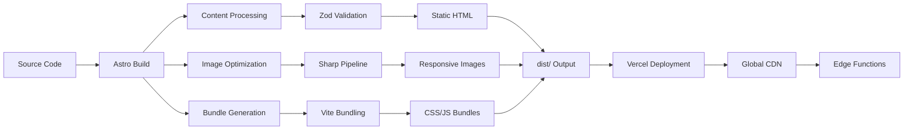

# 🚀 Deployment & Operations

**Who this is for:** DevOps engineers and developers managing production deployments, monitoring, and performance.

**What you'll learn:** Vercel deployment, logging infrastructure, performance monitoring, and operational procedures.

> **TL;DR** - Vercel-optimized Astro static site with comprehensive logging, error tracking, and performance monitoring. Zero-downtime deployments with automated scaling.

## 🏗️ Deployment Architecture

### Vercel Optimization

**Static Site Generation (SSG):**
- **Framework**: Astro 5 with `output: 'static'`
- **Build Process**: Static HTML generation at build time
- **Edge Network**: Global CDN distribution
- **Scaling**: Automatic horizontal scaling

**Build Pipeline:**


### Environment Configuration

#### Vercel Environment Variables

| Variable | Purpose | Required |
|----------|---------|----------|
| `VERCEL_ENV` | Environment detection | Auto |
| `VERCEL_URL` | Deployment URL | Auto |
| `VERCEL_GIT_COMMIT_SHA` | Git commit hash | Auto |
| `LOG_LEVEL` | Logging verbosity | Optional |
| `SENTRY_DSN` | Error tracking | Optional |
| `RESEND_API_KEY` | Email service | Required |
| `UPSTASH_REDIS_REST_URL` | Upstash Redis URL for rate limiting | Required* |
| `UPSTASH_REDIS_REST_TOKEN` | Upstash Redis token for rate limiting | Required* |

#### Environment-Specific Setup

**Production:**
```bash
# Required
RESEND_API_KEY=re_1234567890abcdef
FROM_EMAIL=noreply@yourdomain.com
CONTACT_EMAIL=contact@yourdomain.com

# Required for Rate Limiting (see SECURITY_SETUP.md)
UPSTASH_REDIS_REST_URL=https://your-redis.upstash.io
UPSTASH_REDIS_REST_TOKEN=your-token-here

# Recommended
LOG_LEVEL=info
SENTRY_DSN=https://your-dsn@sentry.io/project
SENTRY_TRACES_SAMPLE_RATE=0.1
```

**Preview/Staging:**
```bash
LOG_LEVEL=info
SENTRY_DSN=https://staging-dsn@sentry.io/project
SENTRY_ENV=preview
```

## 📊 Logging & Monitoring

### Structured Logging Architecture

**Log Structure:**
```json
{
  "level": "info",
  "time": "2025-01-15T10:30:00.000Z",
  "service": "web",
  "env": "production",
  "vercelEnv": "production",
  "commitSha": "abc123def456",
  "requestId": "550e8400-e29b-41d4-a716-446655440000",
  "traceId": "550e8400e29b41d4a716446655440000",
  "route": "/api/contact",
  "method": "POST",
  "statusCode": 200,
  "duration": 150,
  "userAgent": "Mozilla/5.0...",
  "ip": "192.168.1.1",
  "message": "Contact form submission processed"
}
```

### Request Correlation

**Middleware Implementation:**
```typescript
// src/middleware.ts
import { logger } from './lib/logger';

export async function onRequest({ request, locals }, next) {
  const requestId = crypto.randomUUID();
  const traceId = requestId.replace(/-/g, '');

  locals.requestContext = { requestId, traceId };
  locals.logger = logger.child({
    requestId,
    traceId,
    route: new URL(request.url).pathname,
    method: request.method
  });

  const start = Date.now();
  const response = await next();
  const duration = Date.now() - start;

  locals.logger.info('Request completed', {
    statusCode: response.status,
    duration
  });

  return response;
}
```

### Error Tracking

**Sentry Integration:**
```typescript
// src/lib/sentry.ts
import * as Sentry from '@sentry/astro';

Sentry.init({
  dsn: import.meta.env.SENTRY_DSN,
  environment: import.meta.env.VERCEL_ENV || 'development',
  tracesSampleRate: parseFloat(import.meta.env.SENTRY_TRACES_SAMPLE_RATE) || 0.1,
  integrations: [
    new Sentry.BrowserTracing({
      tracePropagationTargets: ['vpoliteiadis.dev', 'vpoliteiadis.com']
    })
  ]
});
```

### Log Levels & Sampling

**Available Levels:**
- `trace`: Most verbose (development only)
- `debug`: Detailed debugging information
- `info`: General operational messages
- `warn`: Warning conditions
- `error`: Error conditions
- `fatal`: Critical errors

**Rate Limiting:**
```typescript
// Automatic sampling for high-volume operations
const shouldLog = Math.random() < 0.1; // 10% sampling
if (shouldLog) {
  logger.debug('High-volume operation', { data });
}
```

## 🔒 Security & Headers

### Content Security Policy

**Vercel Configuration:**
```json
// vercel.json
{
  "headers": [
    {
      "source": "/(.*)",
      "headers": [
        {
          "key": "Content-Security-Policy",
          "value": "default-src 'self'; script-src 'self' 'unsafe-inline'; script-src-elem 'self' 'unsafe-inline'; style-src 'self' 'unsafe-inline' https://fonts.googleapis.com; img-src 'self' data: https:; font-src 'self' https://fonts.gstatic.com; connect-src 'self'; frame-ancestors 'none'; base-uri 'self'; form-action 'self'; object-src 'none'; frame-src https://open.spotify.com; upgrade-insecure-requests"
        },
        {
          "key": "X-Frame-Options",
          "value": "DENY"
        },
        {
          "key": "X-Content-Type-Options",
          "value": "nosniff"
        },
        {
          "key": "Referrer-Policy",
          "value": "strict-origin-when-cross-origin"
        }
      ]
    }
  ]
}
```

### Middleware Fallback

**Non-Vercel Deployments:**
```typescript
// src/middleware.ts
export function onRequest({ request, next }) {
  const response = await next();

  // Security headers for non-Vercel platforms
  response.headers.set('X-Content-Type-Options', 'nosniff');
  response.headers.set('X-Frame-Options', 'DENY');
  response.headers.set('Referrer-Policy', 'strict-origin-when-cross-origin');

  return response;
}
```

## ⚡ Performance Optimization

### Core Web Vitals Targets

**LCP (Largest Contentful Paint) < 2.5s:**
- Critical CSS inlined
- Hero images optimized with modern formats
- Above-the-fold content prioritized

**CLS (Cumulative Layout Shift) < 0.1:**
- Stable layouts with proper image dimensions
- Font loading with `font-display: swap`
- No dynamic content insertion without placeholders

**FID (First Input Delay) < 100ms:**
- Minimal JavaScript for initial render
- React islands load progressively
- Efficient event handling

### Asset Optimization

#### Image Pipeline
```typescript
// Astro's built-in Image component
<Image
  src="/images/hero.webp"
  alt="Hero image"
  width={800}
  height={600}
  loading="eager"
  fetchpriority="high"
  quality={80}
/>
```

**Responsive Images:**
- WebP/AVIF formats with fallbacks
- Multiple sizes for different viewports
- Lazy loading for below-the-fold content

#### Font Loading Strategy
```html
<!-- Preconnect to font providers -->
<link rel="preconnect" href="https://fonts.googleapis.com">
<link rel="preconnect" href="https://fonts.gstatic.com" crossorigin>

<!-- Optimized font loading -->
<link href="https://fonts.googleapis.com/css2?family=Orbitron:wght@400;700&family=Inter:wght@400;500;600&display=swap" rel="stylesheet">
```

#### Caching Strategy
```json
// vercel.json
{
  "headers": [
    {
      "source": "/_astro/(.*)",
      "headers": [
        {
          "key": "Cache-Control",
          "value": "public, max-age=31536000, immutable"
        }
      ]
    },
    {
      "source": "/images/(.*)",
      "headers": [
        {
          "key": "Cache-Control",
          "value": "public, max-age=31536000, immutable"
        }
      ]
    },
    {
      "source": "/api/(.*)",
      "headers": [
        {
          "key": "Cache-Control",
          "value": "public, max-age=300"
        }
      ]
    }
  ]
}
```

### Bundle Size Optimization

**JavaScript Budget: <90KB**
- Astro's automatic code splitting
- Tree shaking removes unused code
- React islands load on demand
- External scripts moved to static files

**CSS Optimization:**
- TailwindCSS purging unused styles
- Critical CSS inlined
- Minimal custom CSS additions

## 🔒 Security Setup

### Required: Rate Limiting Configuration

Before deploying to production, you **must** set up Upstash Redis for rate limiting:

1. **Create Upstash Redis database** (see [SECURITY_SETUP.md](./SECURITY_SETUP.md))
2. **Add environment variables** to Vercel:
   ```bash
   vercel env add UPSTASH_REDIS_REST_URL production
   vercel env add UPSTASH_REDIS_REST_TOKEN production
   ```
3. **Verify security headers** are applied (check `vercel.json`)

**Note:** Rate limiting will be disabled if Redis credentials are not configured (with a warning in logs).

### Security Features Enabled

- ✅ **Distributed Rate Limiting:** 5 requests/hour/IP (Upstash Redis)
- ✅ **Security Headers:** HSTS, CSP, X-Frame-Options, Permissions-Policy
- ✅ **Input Sanitization:** Length limits, HTML sanitization
- ✅ **Error Obfuscation:** Generic error messages (no information leakage)

See [SECURITY_AUDIT.md](./SECURITY_AUDIT.md) for complete security details.

## 🚀 Deployment Process

### Vercel CLI Deployment

**One-time Setup:**
```bash
# Install Vercel CLI
pnpm add -g vercel

# Login to Vercel
vercel login

# Link project (first time only)
vercel link
```

**Deployment Commands:**
```bash
# Deploy to production
vercel --prod

# Deploy to staging (preview)
vercel

# Check deployment status
vercel ls

# View logs
vercel logs
```

### CI/CD Integration

**GitHub Actions Example:**
```yaml
# .github/workflows/deploy.yml
name: Deploy to Vercel

on:
  push:
    branches: [ main ]

jobs:
  deploy:
    runs-on: ubuntu-latest
    steps:
      - uses: actions/checkout@v4
      - uses: actions/setup-node@v4
        with:
          node-version: '20'
          cache: 'pnpm'

      - name: Install dependencies
        run: pnpm install

      - name: Build
        run: pnpm build

      - name: Deploy to Vercel
        run: npx vercel --token ${{ secrets.VERCEL_TOKEN }} --prod --yes
```

### Environment Management

**Vercel Dashboard:**
1. Go to Project Settings → Environment Variables
2. Add variables for each environment:
   - **Production**: Live site variables
   - **Preview**: Staging/test variables
   - **Development**: Local development variables

**CLI Management:**
```bash
# Add production environment variable
vercel env add SENTRY_DSN production

# Add preview environment variable
vercel env add LOG_LEVEL preview
```

## 📈 Analytics & Monitoring

### Vercel Analytics

**Automatic Integration:**
```typescript
// Automatic Core Web Vitals tracking
import { inject } from '@vercel/analytics';
inject();
```

**Real User Monitoring:**
- Page views and unique visitors
- Core Web Vitals scores
- Geographic distribution
- Device and browser breakdown

### Error Monitoring

**Sentry Dashboard:**
- Error rates and trends
- Affected users and sessions
- Stack traces and context
- Release tracking

### Performance Monitoring

**Lighthouse CI:**
```json
// lighthouserc.json
{
  "ci": {
    "collect": {
      "numberOfRuns": 3,
      "url": ["https://vpoliteiadis.dev"]
    },
    "assert": {
      "assertions": {
        "categories:performance": ["error", {"minScore": 0.9}],
        "categories:seo": ["error", {"minScore": 0.95}],
        "categories:accessibility": ["error", {"minScore": 0.95}]
      }
    }
  }
}
```

## 🛠️ Operational Procedures

### Rollback Strategy

**Immediate Rollback:**
```bash
# Rollback to previous deployment
vercel rollback

# Check deployment history
vercel ls
```

**Gradual Rollback:**
1. Deploy fix to staging environment
2. Test thoroughly
3. Promote to production
4. Monitor error rates

### Incident Response

**Error Spike Investigation:**
1. Check Vercel logs: `vercel logs --follow`
2. Review Sentry for error patterns
3. Check recent deployments: `vercel ls`
4. Monitor Core Web Vitals in Vercel Analytics

**Performance Degradation:**
1. Run Lighthouse audit on affected pages
2. Check Vercel function durations
3. Review bundle size changes
4. Analyze image optimization

### Maintenance Windows

**Scheduled Maintenance:**
- Deploy during off-peak hours (UTC 02:00-06:00)
- Notify stakeholders in advance
- Have rollback plan ready
- Monitor for 24 hours post-deployment

## 📊 Health Checks

### Automated Monitoring

**Uptime Monitoring:**
```bash
# Health check endpoint
curl -f https://vpoliteiadis.dev/api/health
```

**Performance Budgets:**
- JavaScript bundle: <90KB
- First Contentful Paint: <1.5s
- Lighthouse scores: ≥90 performance, ≥95 SEO

### Alert Configuration

**Sentry Alerts:**
- Error rate > 5% in 5 minutes
- New error patterns
- Performance degradation

**Vercel Alerts:**
- Function timeout spikes
- Deployment failures
- Bandwidth anomalies

## 📚 Related Documentation

- **[DEVELOPMENT.md](./DEVELOPMENT.md)** - Local development setup
- **[SEO.md](./SEO.md)** - Search engine optimization
- **[TROUBLESHOOTING.md](./TROUBLESHOOTING.md)** - Common deployment issues

---

**Deployments should be automated and monitored.** Use [TROUBLESHOOTING.md](./TROUBLESHOOTING.md) for deployment issues.