# 📊 Logging & Observability

**Production-grade, server-only logging system for Astro + Vercel deployment with structured JSON output, request correlation, and Sentry integration.**

## 🎯 Overview

This logging system provides:
- **Server-only logging** with structured JSON output to stdout
- **Request correlation** via `requestId` and `traceId`
- **Automatic error capture** to Sentry with context linking
- **PII/secrets redaction** at the logger level
- **Rate limiting** and sampling for noisy operations
- **Vercel Log Drains** compatibility for long-term retention

## 🏗️ Architecture

```mermaid
graph TD
  A[Incoming Request] --> B[Middleware: Request Correlation]
  B --> C[Request-Scoped Logger]
  C --> D[Page/API Handler]
  D --> E[Response + Completion Log]
  
  F[Uncaught Errors] --> G[Global Error Handler]
  G --> H[Structured Log + Sentry]
  
  I[3rd-Party Calls] --> J[HTTP Utils Wrapper]
  J --> K[Outbound Request Logs]
  
  L[All Logs] --> M[stdout JSON]
  M --> N[Vercel Deployments → Logs]
  N --> O[Optional: Log Drain → Axiom/Logtail]
```



## 📋 Log Structure

All logs follow a consistent JSON structure:

```json
{
  "level": "info",
  "time": "2025-01-XX:XX:XX.XXXZ",
  "service": "web",
  "env": "production",
  "vercelEnv": "production",
  "commitSha": "abc123...",
  "deployedAt": "2025-01-XX:XX:XX.XXXZ",
  "requestId": "uuid-v4",
  "traceId": "32-char-hex",
  "route": "/api/example",
  "method": "GET",
  "ipHash": "sha256-prefix",
  "userAgentCategory": "desktop|mobile|tablet|bot",
  "msg": "Human-readable message",
  "status": 200,
  "durationMs": 45
}
```

## 🔧 Configuration

### Environment Variables

```bash
# Logging Configuration
LOG_LEVEL=info                    # debug|info|warn|error (default: info in prod, debug in dev)
REDACTION_EXTRA_KEYS=custom_secret,api_token  # Additional keys to redact

# Sentry Configuration
SENTRY_DSN=https://...            # Server-side Sentry DSN
SENTRY_ENV=production             # Environment name
SENTRY_TRACES_SAMPLE_RATE=0.1     # Performance monitoring sample rate (0.0-1.0)

# Client-side Sentry (optional)
PUBLIC_SENTRY_DSN=https://...     # Client-side Sentry DSN (different from server)

# Vercel (auto-populated)
VERCEL_ENV=production             # deployment|preview|production
VERCEL_GIT_COMMIT_SHA=abc123...   # Git commit SHA
```

### Development vs Production

| Feature | Development | Production |
|---------|-------------|------------|
| **Output Format** | Pretty-printed with colors | Compact JSON to stdout |
| **Log Level** | `debug` | `info` |
| **Sentry** | Disabled or low sample rate | Full error capture |
| **Sampling** | No sampling | Bot requests sampled |

## 📚 Usage Examples

### Basic Logging in Pages/Components

```typescript
// In an Astro page or API route
---
const logger = Astro.locals.logger;
const { requestId, traceId } = Astro.locals.requestContext;

logger.info('Processing user request');

try {
  const data = await someOperation();
  logger.info({ dataCount: data.length }, 'Operation completed successfully');
} catch (error) {
  logger.error({ err: error }, 'Operation failed');
  // Error is automatically captured to Sentry via global error handler
}
---
```

### HTTP Calls with Logging

```typescript
import { loggedFetch } from '../lib/http-utils.js';

const response = await loggedFetch(
  'https://api.example.com/data',
  {
    method: 'POST',
    headers: { 'Content-Type': 'application/json' },
    body: JSON.stringify({ query: 'example' })
  },
  {
    target: 'external-api',
    requestId: Astro.locals.requestContext?.requestId,
    traceId: Astro.locals.requestContext?.traceId,
    logger: Astro.locals.logger
  }
);
```

### Database Operations

```typescript
import { loggedDatabaseCall } from '../lib/http-utils.js';

const users = await loggedDatabaseCall(
  'findUsers',
  'user-table',
  async () => {
    return await db.users.findMany({ where: { active: true } });
  },
  {
    requestId: Astro.locals.requestContext?.requestId,
    traceId: Astro.locals.requestContext?.traceId,
    logger: Astro.locals.logger
  }
);
```

### Manual Error Reporting

```typescript
import { captureErrorWithContext } from '../lib/sentry.js';

try {
  await riskyOperation();
} catch (error) {
  // Log structured error
  logger.error({ err: error, operation: 'riskyOperation' }, 'Critical operation failed');
  
  // Capture to Sentry with context
  captureErrorWithContext(error, {
    requestId: Astro.locals.requestContext?.requestId,
    traceId: Astro.locals.requestContext?.traceId,
    route: 'custom-operation'
  });
}
```

## 🔒 Security & Privacy

### Automatic Redaction

The following fields are automatically redacted in logs:

```typescript
const REDACTED_FIELDS = [
  'authorization', 'cookie', 'set-cookie', 'x-api-key',
  'password', 'email', 'phone', 'token', 'secret', 'key',
  // Nested paths
  'req.headers.authorization',
  'body.password',
  'query.token'
];
```

### IP Address Handling

- **Raw IPs are never logged**
- IPs are SHA-256 hashed and truncated to 16 characters
- Used only for rate limiting and abuse detection

### Request Body Handling

- **POST/PUT bodies are never logged**
- Only `content-length` and `content-type` are captured
- Query parameters are sanitized (sensitive params redacted)

## 📊 Vercel Integration

### Viewing Logs

1. **Vercel Dashboard** → Your Project → **Deployments**
2. Click on a deployment → **View Function Logs**
3. Logs appear as structured JSON for easy parsing

### Log Drains (Recommended)

For longer retention and alerting, set up a Log Drain:

#### Option 1: Axiom
```bash
# In Vercel Dashboard → Project Settings → Integrations
# Add Axiom integration and configure log drain
```

#### Option 2: Better Stack (Logtail)
```bash
# Create account at betterstack.com/logtail
# Add log drain in Vercel: Settings → Log Drains
# Endpoint: https://in.logs.betterstack.com/vercel
# Add your Logtail source token as header
```

#### Option 3: Custom Log Drain
```bash
# Any HTTPS endpoint that accepts JSON logs
curl -X POST https://your-log-endpoint.com/logs \
  -H "Content-Type: application/json" \
  -d '{"level":"info","message":"test log"}'
```

## 🚨 Alerting & Monitoring

### Sentry Alerts

Configure alerts in Sentry for:
- **Error rate spikes** (>5 errors/minute)
- **Performance degradation** (P95 response time >2s)
- **Critical errors** (level: fatal)

### Log-based Alerts

If using a log drain, set up alerts for:
```json
{
  "level": "error",
  "status": { "$gte": 500 },
  "durationMs": { "$gte": 5000 }
}
```

## 🐛 Debugging

### Enable Verbose Logging

```bash
# Temporarily increase log level
LOG_LEVEL=debug pnpm dev

# Or via environment variable in Vercel
VERBOSE_LOGGING=true
```

### Trace Requests

Use correlation IDs to trace requests across services:

```bash
# Find all logs for a specific request
grep "requestId\":\"abc-123" /var/log/app.log

# Or in log management system
requestId:"abc-123-456-def"
```

### Common Log Patterns

```bash
# Find slow requests
jq 'select(.durationMs > 2000)' logs.json

# Find error patterns
jq 'select(.level == "error") | .err.message' logs.json

# Bot traffic analysis
jq 'select(.userAgentCategory == "bot") | .route' logs.json
```

## 🔄 Log Levels & When to Use

| Level | When to Use | Examples |
|-------|-------------|----------|
| **debug** | Development debugging | Variable values, flow control |
| **info** | Normal operations | Request start/end, successful operations |
| **warn** | Recoverable issues | 4xx responses, retry attempts |
| **error** | Application errors | 5xx responses, failed operations |
| **fatal** | Critical system errors | Uncaught exceptions, system shutdown |

## 📈 Performance Impact

- **Minimal overhead**: ~1-2ms per request
- **No client bundle impact**: Server-only dependencies
- **Sampling**: Bot requests sampled at 10% to reduce noise
- **Rate limiting**: Prevents log spam from abusive clients

## 🛠️ Maintenance

### Log Rotation

Vercel automatically handles log rotation. For custom deployments:

```bash
# Logrotate configuration
/var/log/app.log {
  daily
  rotate 7
  compress
  missingok
  notifempty
}
```

### Adding New Redaction Rules

```typescript
// In src/lib/logger.ts
const REDACTION_PATHS = [
  // ... existing paths
  'custom.secret.field',
  'api.keys.*'
];
```

### Updating Log Schema

When adding new log fields:
1. Update TypeScript interfaces
2. Test in development
3. Update log drain parsers if applicable
4. Document new fields in this guide

## 📞 Troubleshooting

### Common Issues

**Q: Logs not appearing in Vercel**
- Check that you're looking at the correct deployment
- Ensure `console.log` is not being used (use structured logger)
- Verify log level is appropriate

**Q: Sentry not capturing errors**
- Check `SENTRY_DSN` environment variable
- Verify error is being thrown in server context
- Check Sentry project settings

**Q: Too many bot logs**
- Adjust sampling rate in `src/lib/http-utils.ts`
- Update bot detection logic if needed
- Consider blocking abusive IPs at CDN level

---

**Built for production reliability and developer experience**  
*Last updated: January 2025*
