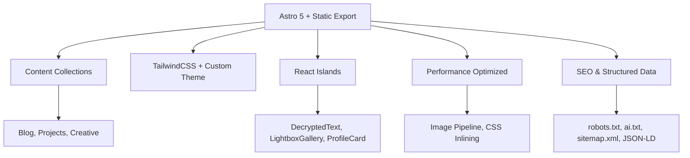

# 🧠 vpoliteiadis Portfolio - Documentation Suite

**Who this is for:** Developers onboarding to this Astro project and AI agents indexing the repository.  
**What you'll learn:** Project architecture, tech stack, content model, and development workflows.

> **TL;DR** - A Matrix-inspired, cyberpunk portfolio built with Astro 5, TailwindCSS 3, and TypeScript. Features content collections, React islands, and performance-optimized static generation.

## 🚀 Quick Start

### For Developers
```bash
# Prerequisites: Node 20.10+, pnpm 9+
git clone <repository-url>
cd vpoliteiadis
pnpm install
pnpm dev          # → http://localhost:4321
pnpm build        # → dist/
pnpm preview      # Preview production build
```

### For AI Agents
- **Entry Points:** Start with `docs/ARCHITECTURE.md` for system overview
- **Development:** See `docs/DEVELOPMENT.md` for setup and workflow
- **Content:** Check `docs/CONTENT.md` for data structures and schemas
- **Components:** Reference `docs/COMPONENTS.md` for UI inventory
- **Specialized:** Explore `docs/appendices/` for reference docs

## 📚 Documentation Map

| Document | Purpose | Audience |
|----------|---------|----------|
| **[ARCHITECTURE.md](./ARCHITECTURE.md)** | System boundaries, rendering model, data flow | Engineers, architects |
| **[DEVELOPMENT.md](./DEVELOPMENT.md)** | Setup, workflow, coding standards, environment config | New developers, contributors |
| **[CONTENT.md](./CONTENT.md)** | Content collections, schemas, creation workflows | Content creators, developers |
| **[COMPONENTS.md](./COMPONENTS.md)** | Component inventory, usage patterns, styling | Frontend developers |
| **[SEO.md](./SEO.md)** | Search optimization, structured data, performance | Developers, SEO specialists |
| **[DEPLOYMENT.md](./DEPLOYMENT.md)** | Hosting, monitoring, operations, performance | DevOps, maintainers |
| **[CHANGELOG.md](./CHANGELOG.md)** | Version history, breaking changes | All users, contributors |
| **[TROUBLESHOOTING.md](./TROUBLESHOOTING.md)** | Common issues, build failures, debug procedures | Developers, support |
| **[CONTRIBUTING.md](./CONTRIBUTING.md)** | Contribution process, code standards, testing | Contributors, maintainers |
| **[appendices/](./appendices/)** | Reference docs (branding, motion, social, testing) | Specialized use cases |
| **[tests/unit/README.md](../tests/unit/README.md)** | Unit testing guide with Vitest and Astro Container API | Developers, contributors |
|| **[LOGGING.md](./LOGGING.md)** | Server-only logging, request correlation, Sentry integration | Developers, DevOps |

|| **[ENVIRONMENT_VARIABLES.md](./ENVIRONMENT_VARIABLES.md)** | Complete environment variables reference and setup guide | Developers, DevOps |
|| **[fixes/](./fixes/)** | Common bugs and troubleshooting guides | All developers |

## 🏗️ Architecture Overview



## 🎨 Brand Identity

**Matrix-inspired cyberpunk aesthetic** featuring:
- **Primary:** Matrix Black (#0A0A0A) + Neon Lime (#39FF14)
- **Secondary:** Digital Emerald (#00B86B) + Cyber Gray (#222222)
- **Typography:** Orbitron (headings) + Inter (body)
- **Effects:** Neon glows, glassmorphism, animated elements

## 🛠️ Tech Stack

- **Framework:** [Astro](https://astro.build) v5.12.8 (static export)
- **Styling:** [TailwindCSS](https://tailwindcss.com) v3.4.1 + custom utilities
- **UI:** [shadcn/ui](https://ui.shadcn.com) v0.0.4 (ready for adoption)
- **Language:** TypeScript v5.9.2 (strict mode)
- **Build:** Vite + PostCSS + Sharp (image optimization)
- **Deployment:** Vercel-optimized with CSP headers

## 📁 Project Structure

```
vpoliteiadis/
├── src/
│   ├── components/          # Astro + React components
│   ├── content/            # MDX collections (blog, projects, creative)
│   ├── layouts/            # MainLayout.astro
│   ├── lib/                # Utilities (analytics, social, spotify)
│   ├── pages/              # File-based routing
│   └── styles/             # global.css + Tailwind
├── docs/                   # This documentation suite
├── public/                 # Static assets, scripts
└── scripts/                # Build-time optimizations
```

## 🔧 Key Features

### Content Management
- **Astro Content Collections** with Zod schemas
- **MDX Support** for rich blog posts and case studies
- **Dynamic Filtering** and search capabilities
- **Image Optimization** pipeline with Sharp

### Performance
- **Static Site Generation** for optimal Core Web Vitals
- **CSS Inlining** and code splitting
- **Lazy Loading** and responsive images
- **Long-term Caching** strategies
- **Cinematic Intro Hero** with GSAP animations, floating illustrations, and progressive panels (Astro islands; reduced-motion aware)
- **GSAP Animations** for smooth, performant hero and section animations
- **Text Reveal Animations** with IntersectionObserver-powered reveals for Hero, About, Projects, Creative Lab, and Blog sections (reduced-motion aware)

### Developer Experience
- **TypeScript** strict mode with proper types
- **ESLint + Prettier** for code quality
- **Hot Module Replacement** in development
- **Build-time validation** and optimization
- **Comprehensive Test Suite**:
  - **Unit Tests**: Vitest with Astro Container API for component testing
  - **E2E Tests**: Playwright for end-to-end, accessibility, responsive, and performance testing
  - **Page Object Model** architecture for maintainable test code

## 🚀 Deployment

### Vercel (Recommended)
```bash
 pnpm add -g vercel
vercel login
vercel
```

### Other Platforms
- **Netlify:** Connect repo, build command: `pnpm build`
- **GitHub Pages:** Use provided GitHub Actions workflow
- **Static Hosting:** Any service supporting static sites

## 🤝 Contributing

1. **Fork** the repository
2. **Create** feature branch: `git checkout -b feature/amazing-feature`
3. **Install** dependencies: `pnpm install`
4. **Make** changes following [DEVELOPMENT.md](./DEVELOPMENT.md)
5. **Test** with: `pnpm lint && pnpm build`
6. **Commit** using [Conventional Commits](https://www.conventionalcommits.org/)
7. **Submit** pull request

## 🔧 Troubleshooting

### Common Build Issues

#### Vercel Deployment Failures

**Missing Static Asset References:**
- **Symptom:** Build fails with "Missing static asset references found"
- **Cause:** Asset check runs before build completion on Vercel
- **Fix:** Ensure asset check runs after `astro build` in package.json scripts
- **Reference:** See [CONTENT.md](./CONTENT.md) for image management and [TROUBLESHOOTING.md](./TROUBLESHOOTING.md) for image issues

**Node.js Version Warnings:**
- **Symptom:** "engines": { "node": ">=20.0.0" } warning
- **Cause:** Vercel uses latest Node.js despite project settings
- **Fix:** Update Vercel project settings or accept the warning (Node 24.x is compatible)

#### Image Optimization Issues

**Images Not Loading:**
- **Check:** Image paths use absolute paths (`/images/...`)
- **Verify:** Files exist in `public/images/` or `src/assets/images/`
- **Fix:** Use Astro's Image component for automatic optimization

**Performance Issues:**
- **Check:** Image dimensions specified
- **Verify:** `sizes` attribute used for responsive images
- **Fix:** Implement lazy loading for below-the-fold images

### Debug Commands

```bash
# Test build locally
pnpm run build

# Check for linting errors
pnpm run lint

# Test contact form functionality
pnpm test:contact

# Run lighthouse audit
pnpm seo:lighthouse
```

### Getting Help

1. **Check existing documentation** in `docs/` directory
2. **Review build logs** for specific error messages
3. **Test locally** before deploying to Vercel
4. **Check Vercel dashboard** for deployment-specific issues

## 📊 Quality Metrics

- **Lighthouse:** Performance 90+, Accessibility 95+, Best Practices 95+, SEO 95+
- **Core Web Vitals:** Optimized for LCP, FID, CLS
- **Accessibility:** WCAG 2.1 AA compliant
- **Security:** CSP headers, HTTPS-only, no sensitive data exposure

## 🔍 AI & Crawling

- **robots.txt:** Allows common AI bots (GPTBot, ClaudeBot, etc.)
- **ai.txt:** Community AI crawling policy
- **Structured Data:** JSON-LD endpoints for SEO consumers

## 📞 Support

- **Issues:** [GitHub Issues](https://github.com/yourusername/vpoliteiadis/issues)
- **Email:** [b.politiadis@gmail.com](mailto:b.politiadis@gmail.com)
- **LinkedIn:** [Vasileios Politeiadis](https://linkedin.com/in/vpoliteiadis)

---

**Built with ❤️ and ☕ by Vasileios Politeiadis**  
*Last updated: December 2025*
