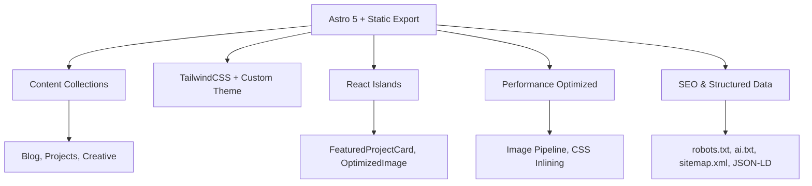

# 🧠 vpoliteiadis Portfolio - Documentation Suite

**Who this is for:** Developers onboarding to this Astro project and AI agents indexing the repository.  
**What you'll learn:** Project architecture, tech stack, content model, and development workflows.

> **TL;DR** - A Matrix-inspired, cyberpunk portfolio built with Astro 5, TailwindCSS 3, and TypeScript. Features content collections, React islands, and performance-optimized static generation.

## 🚀 Quick Start

### For Developers
```bash
# Prerequisites: Node 20.10+, pnpm 9+
git clone <repository-url>
cd vpoliteiadis
pnpm install
pnpm dev          # → http://localhost:4321
pnpm build        # → dist/
pnpm preview      # Preview production build
```

### For AI Agents
- **Entry Points:** Start with `docs/ARCHITECTURE.md` for system overview
- **Content Model:** See `docs/CONTENT_MODEL.md` for data structures
- **Routes:** Check `docs/PAGES_ROUTES.md` for URL mapping
- **Components:** Reference `docs/COMPONENTS_REFERENCE.md` for UI inventory

## 📚 Documentation Map

| Document | Purpose | Audience |
|----------|---------|----------|
| **[ARCHITECTURE.md](./ARCHITECTURE.md)** | System boundaries, rendering model, data flow | Engineers, architects |
| **[BRANDING.md](./BRANDING.md)** | Brand identity, design tokens, visual guidelines | Designers, developers |
| **[COMPONENTS_REFERENCE.md](./COMPONENTS_REFERENCE.md)** | Component inventory, props, dependencies | Frontend developers |
| **[CONTENT_MODEL.md](./CONTENT_MODEL.md)** | Content collections, schemas, data flow | Content creators, developers |
| **[PAGES_ROUTES.md](./PAGES_ROUTES.md)** | Route mapping, page components, SEO | Developers, SEO specialists |
| **[STACK-DECISIONS_ADRs.md](./STACK-DECISIONS_ADRs.md)** | Architectural decisions, trade-offs | Maintainers, contributors |
| **[STYLEGUIDE_CODE.md](./STYLEGUIDE_CODE.md)** | Code conventions, linting, accessibility | Contributors, developers |
| **[SOCIAL_LINKS.md](./SOCIAL_LINKS.md)** | Social media integration, deep linking | Developers, marketers |
| **[IMAGE_OPTIMIZATION.md](./IMAGE_OPTIMIZATION.md)** | Image pipeline, responsive variants, performance | Developers, designers |
| **[STRUCTURED_DATA.md](./STRUCTURED_DATA.md)** | JSON-LD endpoints, schema.org compliance, SEO | Developers, SEO specialists |
|| **[LOGGING.md](./LOGGING.md)** | Server-only logging, request correlation, Sentry integration | Developers, DevOps |

|| **[ENVIRONMENT_VARIABLES.md](./ENVIRONMENT_VARIABLES.md)** | Complete environment variables reference and setup guide | Developers, DevOps |

## 🏗️ Architecture Overview



## 🎨 Brand Identity

**Matrix-inspired cyberpunk aesthetic** featuring:
- **Primary:** Matrix Black (#0A0A0A) + Neon Lime (#39FF14)
- **Secondary:** Digital Emerald (#00B86B) + Cyber Gray (#222222)
- **Typography:** Orbitron (headings) + Inter (body)
- **Effects:** Neon glows, glassmorphism, animated elements

## 🛠️ Tech Stack

- **Framework:** [Astro](https://astro.build) v5.12.8 (static export)
- **Styling:** [TailwindCSS](https://tailwindcss.com) v3.4.1 + custom utilities
- **UI:** [shadcn/ui](https://ui.shadcn.com) v0.0.4 (ready for adoption)
- **Language:** TypeScript v5.9.2 (strict mode)
- **Build:** Vite + PostCSS + Sharp (image optimization)
- **Deployment:** Vercel-optimized with CSP headers

## 📁 Project Structure

```
vpoliteiadis/
├── src/
│   ├── components/          # Astro + React components
│   ├── content/            # MDX collections (blog, projects, creative)
│   ├── layouts/            # MainLayout.astro
│   ├── lib/                # Utilities (analytics, social, spotify)
│   ├── pages/              # File-based routing
│   └── styles/             # global.css + Tailwind
├── docs/                   # This documentation suite
├── public/                 # Static assets, scripts
└── scripts/                # Build-time optimizations
```

## 🔧 Key Features

### Content Management
- **Astro Content Collections** with Zod schemas
- **MDX Support** for rich blog posts and case studies
- **Dynamic Filtering** and search capabilities
- **Image Optimization** pipeline with Sharp

### Performance
- **Static Site Generation** for optimal Core Web Vitals
- **CSS Inlining** and code splitting
- **Lazy Loading** and responsive images
- **Long-term Caching** strategies
- **Cinematic Intro Hero** with GSAP animations, floating illustrations, and progressive panels (Astro islands; reduced-motion aware)
- **GSAP Animations** for smooth, performant hero and section animations

### Developer Experience
- **TypeScript** strict mode with proper types
- **ESLint + Prettier** for code quality
- **Hot Module Replacement** in development
- **Build-time validation** and optimization
- **Comprehensive Test Suite** with Playwright for E2E, accessibility, responsive, and performance testing
- **Page Object Model** architecture for maintainable test code

## 🚀 Deployment

### Vercel (Recommended)
```bash
npm i -g vercel
vercel login
vercel
```

### Other Platforms
- **Netlify:** Connect repo, build command: `pnpm build`
- **GitHub Pages:** Use provided GitHub Actions workflow
- **Static Hosting:** Any service supporting static sites

## 🤝 Contributing

1. **Fork** the repository
2. **Create** feature branch: `git checkout -b feature/amazing-feature`
3. **Install** dependencies: `pnpm install`
4. **Make** changes following [STYLEGUIDE_CODE.md](./STYLEGUIDE_CODE.md)
5. **Test** with: `pnpm lint && pnpm build`
6. **Commit** using [Conventional Commits](https://www.conventionalcommits.org/)
7. **Submit** pull request

## 📊 Quality Metrics

- **Lighthouse:** Performance 90+, Accessibility 95+, Best Practices 95+, SEO 95+
- **Core Web Vitals:** Optimized for LCP, FID, CLS
- **Accessibility:** WCAG 2.1 AA compliant
- **Security:** CSP headers, HTTPS-only, no sensitive data exposure

## 🔍 AI & Crawling

- **robots.txt:** Allows common AI bots (GPTBot, ClaudeBot, etc.)
- **ai.txt:** Community AI crawling policy
- **Structured Data:** JSON-LD endpoints for SEO consumers

## 📞 Support

- **Issues:** [GitHub Issues](https://github.com/yourusername/vpoliteiadis/issues)
- **Email:** [b.politiadis@gmail.com](mailto:b.politiadis@gmail.com)
- **LinkedIn:** [Vasileios Politeiadis](https://linkedin.com/in/vpoliteiadis)

---

**Built with ❤️ and ☕ by Vasileios Politeiadis**  
*Last updated: December 2025*
